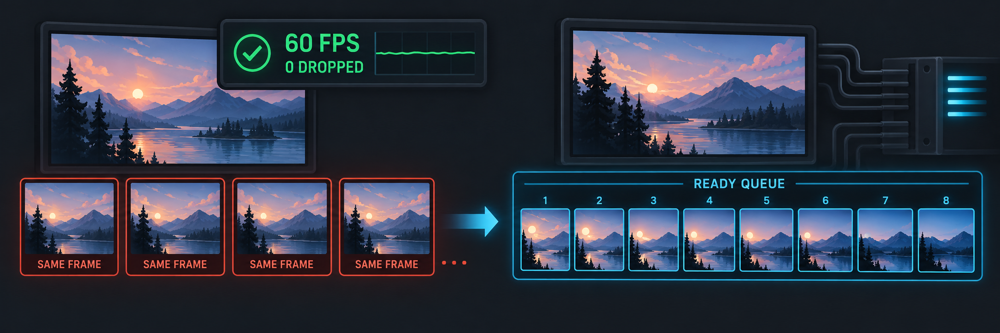

OBS Studio Capture Stutter Fix
==============================

This is an independent Windows fork of `OBS Studio 32.2.2
<https://github.com/obsproject/obs-studio/releases/tag/32.2.2>`_.  It was made
for a narrow but very recognizable capture problem that ordinary performance
advice did not explain.  It is not an official OBS Project release.

.. image:: https://github.com/veelasama/obs-studio-capture-stutter-fix/actions/workflows/capture-stutter-windows.yaml/badge.svg?branch=master
   :alt: Capture Stutter Fix Windows build status
   :target: https://github.com/veelasama/obs-studio-capture-stutter-fix/actions/workflows/capture-stutter-windows.yaml

`Download the Windows installer
<https://github.com/veelasama/obs-studio-capture-stutter-fix/releases>`_ ·
`Read the technical notes
<https://github.com/veelasama/obs-studio-capture-stutter-fix/blob/master/CAPTURE_STUTTER_FIX.md>`_ ·
`Say whether it helped
<https://github.com/veelasama/obs-studio-capture-stutter-fix/discussions/2>`_

The problem this fork targets
-----------------------------

The game itself continues to run smoothly and looks smooth on the monitor.
OBS holds its configured frame rate, usually 60 FPS, and its statistics show
neither rendering lag nor encoder overload.  Even so, the OBS preview or the
finished recording suddenly begins to repeat or skip frames.  The captured
motion can look as though it has fallen from 60 FPS to roughly 30–40 unique
frames per second.  A bad interval may appear only after three, six, or twenty
minutes, grow from occasional skips into a longer series, and then recover on
its own.  It can happen in the preview while recording is stopped, which rules
out many encoder and storage explanations.

The issue was first investigated on GeForce RTX 5060, 5060 Ti, and 5070 Ti
systems after the RTX 50-series launch.  Old and new NVIDIA drivers, Windows
10 and current Windows 11 builds, encoder choices, capture settings, and a
complete PC rebuild did not provide a dependable cure.  Similar behavior was
also observed while testing Linux, although this fork changes Windows capture
paths only and does not claim that every platform shares one root cause.  The
original public report and early troubleshooting are preserved in the `OBS
forum thread <https://obsproject.com/forum/threads/fps-drop-preview-record-need-help.195614/>`_.

Why the patch is different
--------------------------

The investigation did not find evidence that the game, encoder, or OBS video
clock was simply too slow.  The stronger explanation was a timing failure at
the handoff between GPU capture completion and the frame OBS sampled for its
next video tick.  The stock shared-texture path can repeatedly expose the same
image when capture and rendering settle into an unlucky phase, even though all
headline FPS and overload counters remain normal.  The tests do not prove
whether the original trigger belongs entirely to NVIDIA, DXGI, Windows
scheduling, or their interaction with OBS.

This fork gives producers an eight-slot queue of completed GPU frames and uses
shared fences to tell OBS which frame is actually ready.  OBS consumes the
queue with a bounded policy instead of repeatedly sampling one mutable shared
texture.  The graphics thread joins MMCSS as ``Playback`` with high relative
priority, and preview swap-chain latency is set to two frames.  DXGI Desktop
Duplication receives its own asynchronous D3D11 producer; pointer-only desktop
updates are not mistaken for video frames.  If queue setup, texture sharing,
or a fence fails, the code returns to the original OBS path rather than
leaving a broken source.

What has been tested
--------------------

Warhammer 40,000: Rogue Trader through Direct3D 11 was the main long-running
reproduction case.  Early recordings contained obvious recurring series of
skips.  The queued handoff removed those long episodes in repeated tests.  A
one-hour recording still contained a few isolated short hitches around the
16–17, 34, 40, 46–47, 52, and 59 minute marks.  Later instrumented runs reduced
the remaining events to very short or sometimes visually ambiguous single
hitches.  This is why the project describes a strong improvement rather than
claiming that every possible stutter is eliminated.

Satisfactory through Direct3D 12 showed frequent characteristic capture drops
almost immediately; the all-API queue produced a clear visible improvement.
For DXGI Desktop Duplication, a 45-second 60 FPS validation produced 2,700
frames with no adjacent duplicate pairs and no timestamp errors.  One desktop
acquisition timeout occurred and was absorbed without disturbing output
cadence.  The final test binary and the source in this branch were compared
before the public build was created.

Capture coverage and limits
---------------------------

Game Capture is patched for Direct3D 9, Direct3D 10, Direct3D 11, Direct3D 12,
OpenGL, and Vulkan, with both 64-bit and 32-bit hooks.  Display Capture is
patched when it uses DXGI Desktop Duplication.  Windows Graphics Capture (WGC)
is deliberately unchanged.  Browser sources, capture devices, and Window
Capture modes that do not pass through these paths do not gain a queue merely
because they are visible in the same scene.

The game does not need to run at 60 FPS.  Running a game at 120, 144, or 240 FPS
while OBS records at 60 FPS is supported.  The Game Capture option **Limit
capture framerate** may remain enabled or disabled; the fix does not depend on
that checkbox.  HDR code paths are present, but the local DXGI validation was
performed in SDR.  A separately rendered hardware cursor can lead a queued
desktop image by one or two frames.

Installation and recovery
-------------------------

The release contains a normal Windows ``.exe`` installer.  It installs to
``C:\Program Files\obs-studio-capture-stutter-fix`` so it can live beside the
official OBS installation.  The custom build is not code-signed, so Windows
SmartScreen may display an unknown-publisher warning.  Each release includes a
SHA-256 checksum for the installer.

The new capture paths are enabled by default.  To isolate a regression, start
OBS with ``OBS_READY_QUEUE=0`` to disable the Game Capture consumer queue or
``OBS_DXGI_READY_QUEUE=0`` to disable the DXGI Display Capture queue.  The
tested Game Capture policy is ``bounded``; setting
``OBS_READY_QUEUE_POLICY=latest`` selects the newest completed frame instead.

This fork is not intended to become a separately supported OBS distribution.
The `feedback Discussion
<https://github.com/veelasama/obs-studio-capture-stutter-fix/discussions/2>`_
only asks whether the installer helped with the recognizable symptom.  A short
answer is enough; logs and a bug-report template are not required.

Build it yourself
-----------------

The release is built from the public source in this repository.  The easiest
way to reproduce the exact Windows installer is to fork the repository, enable
GitHub Actions, open **Actions → Windows Capture Stutter Build**, and run the
workflow on the release tag.  The workflow compiles OBS and both Game Capture
hooks from source, packages the result, creates the NSIS installer, calculates
its SHA-256 hash, and uploads both files.  The complete recipe is visible in
``.github/workflows/capture-stutter-windows.yaml`` and the installer definition
is in ``.github/installer/capture-stutter-fix.nsi``.

To compile locally, use 64-bit Windows with Git, PowerShell 7.2 or later,
``winget``, and Visual Studio 2026 with Desktop development with C++ and the
Windows 11 SDK 10.0.26100.  Clone the release tag together with every
submodule, then run the same build script used by CI from PowerShell 7::

   git clone --recurse-submodules --branch 32.2.2-capture-stutter-fix-v1.0.0 https://github.com/veelasama/obs-studio-capture-stutter-fix.git
   cd obs-studio-capture-stutter-fix
   $env:CI = '1'
   pwsh -File .\.github\scripts\Build-Windows.ps1 -Target x64 -Configuration RelWithDebInfo

The script downloads the pinned OBS dependency bundles whose hashes are stored
in ``CMakePresets.json``.  The installed build is written to
``build_x64\install``.  To create the intermediate OBS package as well, run::

   pwsh -File .\.github\scripts\Package-Windows.ps1 -Target x64 -Configuration RelWithDebInfo

No private source, private dependency, or signing key is needed to reproduce
the executable code.  Release installers are currently unsigned, so a locally
built executable will also avoid any false impression that the fork carries an
OBS Project or commercial code-signing identity.

Fork credits are listed in `FORK_AUTHORS.md
<https://github.com/veelasama/obs-studio-capture-stutter-fix/blob/master/FORK_AUTHORS.md>`_.
OBS Studio and its upstream history remain credited to the OBS Project
contributors.  All source changes in this fork remain under GPL-2.0-or-later.
